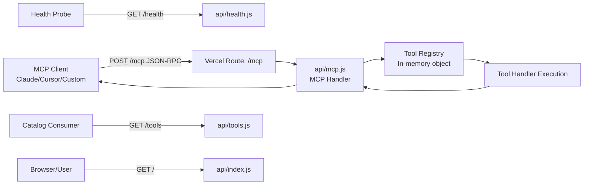
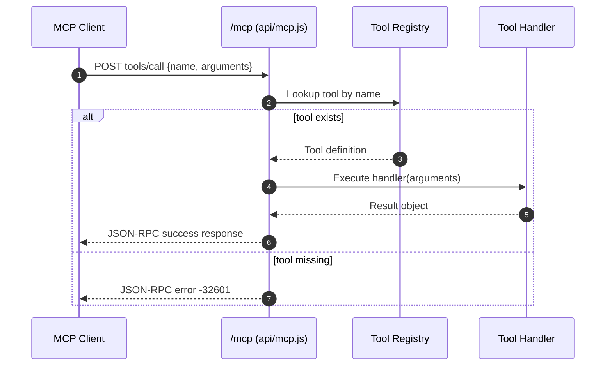

# Ultimate MCP Server

Production-ready MCP (Model Context Protocol) server deployed as Vercel serverless functions.

## Organization Support
- We can help your organization design and build a custom MCP server at low cost.
- We also provide free support in architecture and decision-making for MCP adoption and rollout.

## Executive Summary
- Purpose: expose a single MCP endpoint with a broad utility toolset for text, data, web, date/time, business, developer, and AI template workflows.
- Runtime model: stateless HTTP JSON-RPC over `POST /mcp`.
- Current scope: 90 tools across 7 categories.
- Platform: Vercel serverless functions (`api/*.js`).

## Core Capabilities
- MCP JSON-RPC endpoint with `initialize`, `tools/list`, and `tools/call` support.
- Tool catalog endpoint for discovery (`GET /tools`).
- Health endpoint for monitoring (`GET /health`).
- Landing page endpoint (`GET /`).

## System Flow
1. MCP client sends JSON-RPC request to `POST /mcp`.
2. `api/mcp.js` validates method and request body.
3. Request router dispatches by method:
- `initialize` returns protocol/server capability metadata.
- `tools/list` returns tool metadata and JSON schemas.
- `tools/call` resolves tool by name and executes its handler.
4. Tool result is serialized into MCP response content.
5. Errors are returned as JSON-RPC error objects.

## Design Diagram (HLD)


## SSD (System Sequence Diagram)


## LLD (Low-Level Design)
### Components
- `api/mcp.js`: request parsing, CORS/method guards, JSON-RPC dispatch, tool execution, error mapping.
- `api/tools.js`: public catalog API grouped by category.
- `api/health.js`: health metadata for uptime checks.
- `api/index.js`: human-readable landing page.
- `vercel.json`: route mapping from public paths to serverless files.

### JSON-RPC Contract (`POST /mcp`)
- `initialize`
- `tools/list`
- `tools/call`

### Error Behavior
- `405` for non-POST methods on `/mcp`.
- `400` with JSON-RPC parse error for invalid payload.
- JSON-RPC `-32601` for unknown method/tool.
- JSON-RPC `-32000` for runtime handler failures.

### State and Concurrency
- Server is stateless per request.
- Tool registry is in-process constant data.
- No persistent storage dependencies.

## DDD (Domain-Driven Design View)
### Bounded Context
- `MCP Tool Execution Context`: receives protocol requests, resolves tools, returns deterministic results.

### Domain Concepts
- Entity: `ToolDefinition` (`name`, `category`, `description`, `inputSchema`, `handler`).
- Value Object: `JsonRpcRequest` (`id`, `method`, `params`).
- Value Object: `JsonRpcResponse` (`result` or `error`).
- Aggregate: `ToolRegistry` (consistency boundary for all tool definitions).

### Domain Invariants
- Tool name must uniquely identify exactly one handler.
- `tools/list` must expose schema and description for callable tools.
- `tools/call` response must be serialized as MCP content text payload.

## API Reference
| Endpoint | Method | Purpose |
| --- | --- | --- |
| `/mcp` | POST | MCP JSON-RPC endpoint |
| `/tools` | GET | Tool catalog and category grouping |
| `/health` | GET | Health and metadata |
| `/` | GET | HTML landing page |

## Repository Structure
```text
ultimate-mcp-server/
  api/
    index.js
    health.js
    tools.js
    mcp.js
  lib/
  tools/
  vercel.json
  package.json
  README.md
```

## Local Development
```bash
npm install
npm run dev
```

Default local URL with Vercel dev:
- `http://localhost:3000/mcp`
- `http://localhost:3000/tools`
- `http://localhost:3000/health`

## Deploy to Vercel
```bash
git clone <repo-url>
cd ultimate-mcp-server
vercel deploy --prod
```

## MCP Client Integration
### Claude Desktop
```json
{
  "mcpServers": {
    "ultimate-mcp": {
      "command": "npx",
      "args": ["-y", "mcp-remote", "https://YOUR-DEPLOYMENT.vercel.app/mcp"]
    }
  }
}
```

### Generic MCP HTTP Example
```bash
curl -X POST https://YOUR-DEPLOYMENT.vercel.app/mcp \
  -H "Content-Type: application/json" \
  -d '{"jsonrpc":"2.0","id":1,"method":"tools/list"}'
```

## Tool Categories
- Text & Content
- Data & Math
- Web & Research
- Date & Time
- Business & Finance
- Developer Tools
- AI Prompts & Templates

## Operational Notes
- CORS is enabled with `Access-Control-Allow-Origin: *`.
- `/mcp` handles `OPTIONS` for preflight requests.
- Project currently has no dedicated unit/integration test suite.

## License
MIT
